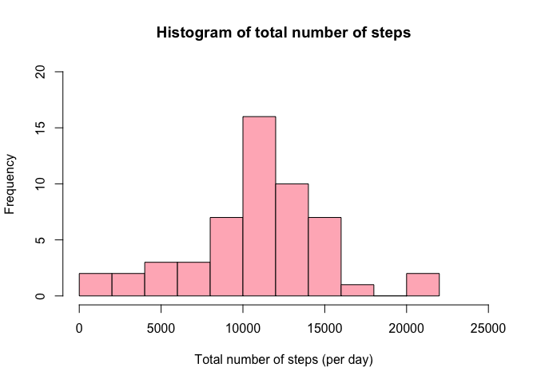
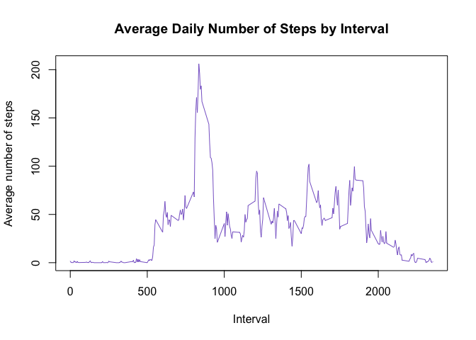
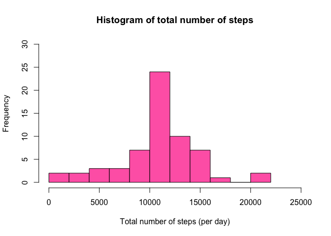
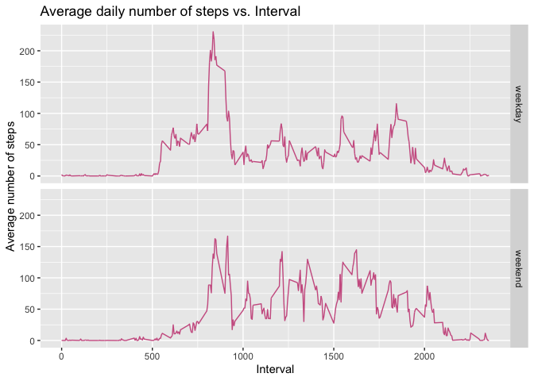

###### By Nishat Zaman

#### 1. Loading and preprocessing data

Loading the data set.


```r
library("tidyverse")
```

```
## ── Attaching packages ───────────────────────────────────────────── tidyverse 1.3.0 ──
```

```
## ✓ ggplot2 3.3.1     ✓ purrr   0.3.4
## ✓ tibble  3.0.1     ✓ dplyr   1.0.0
## ✓ tidyr   1.0.3     ✓ stringr 1.4.0
## ✓ readr   1.3.1     ✓ forcats 0.5.0
```

```
## ── Conflicts ──────────────────────────────────────────────── tidyverse_conflicts() ──
## x dplyr::filter() masks stats::filter()
## x dplyr::lag()    masks stats::lag()
```

```r
data <- read_csv(file = "activity.csv")
```

```
## Parsed with column specification:
## cols(
##   steps = col_double(),
##   date = col_date(format = ""),
##   interval = col_double()
## )
```

Getting only the rows in the data set that are complete (i.e. have no NAs).

```r
data_complete <- data[complete.cases(data), ]
```

#### 2. What is mean total number of steps taken per day?
Calculating the total number of steps taken per day.

```r
res <- aggregate(data_complete$steps, by=list(date = data_complete$date), FUN=sum)
```

Making a histogram of the total number of steps taken each day.

```r
hist(res$x, breaks = 10, col = "lightpink", xlim = c(0, 25000), ylim = c(0, 20), xlab = "Total number of steps (per day)", main = "Histogram of total number of steps")
```

<!-- -->

Calculating and reporting the mean and median of the total number of steps taken per day.

Mean:

```r
mean_steps <- mean(res$x)
print(mean_steps)
```

```
## [1] 10766.19
```

Median:

```r
median_steps <- median(res$x)
print(median_steps)
```

```
## [1] 10765
```

#### 3. What is the average daily activity pattern?

Making a time series plot of the 5-minute interval (x-axis) and the average number of steps taken, averaged across all days (y-axis).


```r
res <- aggregate(data_complete$steps, by=list(interval = data_complete$interval), FUN=mean)

plot(res$interval, res$x, type = "n", xlab = "Interval", ylab = "Average number of steps", main = "Average Daily Number of Steps by Interval")
lines(res$interval, res$x, type = "l", col = "mediumpurple3")
```

<!-- -->

Which 5-minute interval, on average across all the days in the dataset, contains the maximum number of steps?


```r
rowindex <- which.max(res$x)

print(res[rowindex,]$interval)
```

```
## [1] 835
```

#### 4. Imputing missing values

Calculate and report the total number of missing values in the dataset (i.e. the total number of rows with NAs).


```r
res <- complete.cases(data)
missing_total <- sum((!res))
print(missing_total)
```

```
## [1] 2304
```

Devise a strategy for filling in all of the missing values in the dataset: *Use the mean for that 5 min interval*

Create a new dataset that is equal to the original dataset but with the missing data filled in.

```r
data_new <- data %>%
            group_by(interval) %>%
            summarise(avg = mean(steps, na.rm = TRUE)) %>%
            merge(data, ., all.x = TRUE) %>%
            mutate(steps = ifelse(is.na(steps) == TRUE, avg, steps)) %>%
            select(!avg)
```

```
## `summarise()` ungrouping output (override with `.groups` argument)
```

Make a histogram of the total number of steps taken each day


```r
res <- aggregate(data_new$steps, by=list(date = data_new$date), FUN=sum)

hist(res$x, breaks = 10, col = "hotpink", xlim = c(0, 25000), ylim = c(0, 30), xlab = "Total number of steps (per day)", main = "Histogram of total number of steps")
```

<!-- -->

Report the mean and median total number of steps taken per day.

Mean:


```r
mean_new <- mean(res$x)
print(mean_new)
```

```
## [1] 10766.19
```

Median:


```r
median_new <- median(res$x)
print(median_new)
```

```
## [1] 10766.19
```

#### 5. Are there differences in activity patterns between weekdays and weekends?

Create a new factor variable in the dataset with two levels – “weekday” and “weekend” indicating whether a given date is a weekday or weekend day.


```r
data_new$day <- weekdays(data_new$date)

data_new$day_type <- ifelse(data_new$day == "Saturday" | data_new$day == "Sunday", "weekend", "weekday")

#converting variable to factor
data_new$day_type <- as.factor(data_new$day_type)
```

Make a panel plot containing a time series plot of the 5-minute interval (x-axis) and the average number of steps taken, averaged across all weekday days or weekend days (y-axis).


```r
data_new <- data_new %>%
            group_by(day_type, interval) %>%
            mutate(avg = mean(steps, na.rm = TRUE))

p <- ggplot(data = data_new, aes(interval, avg)) +
    geom_line(color = "hotpink3") +
    labs(title = "Average daily number of steps vs. Interval", y = "Average number of steps", x = "Interval") +
    facet_grid(day_type ~ .)

show(p)
```

<!-- -->
